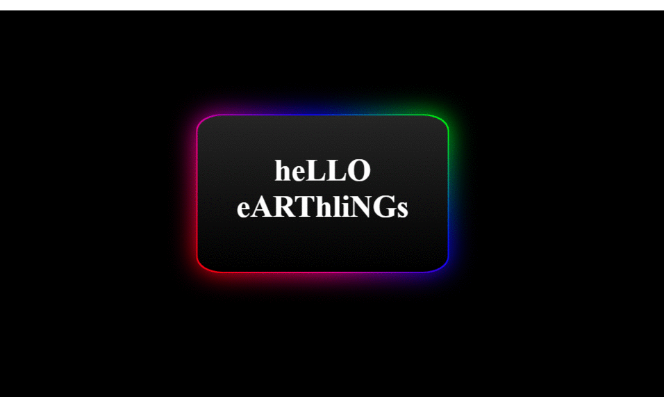

# CSS-ANIMATED-GRADIENT-BOX
Animated Gradient Box using CSS
Colors are changed in background with their shadows dispalyed.
## Run
Clone the repository and run '.html' file.

> Gif displaying the gradient box, not exact but understandable.

